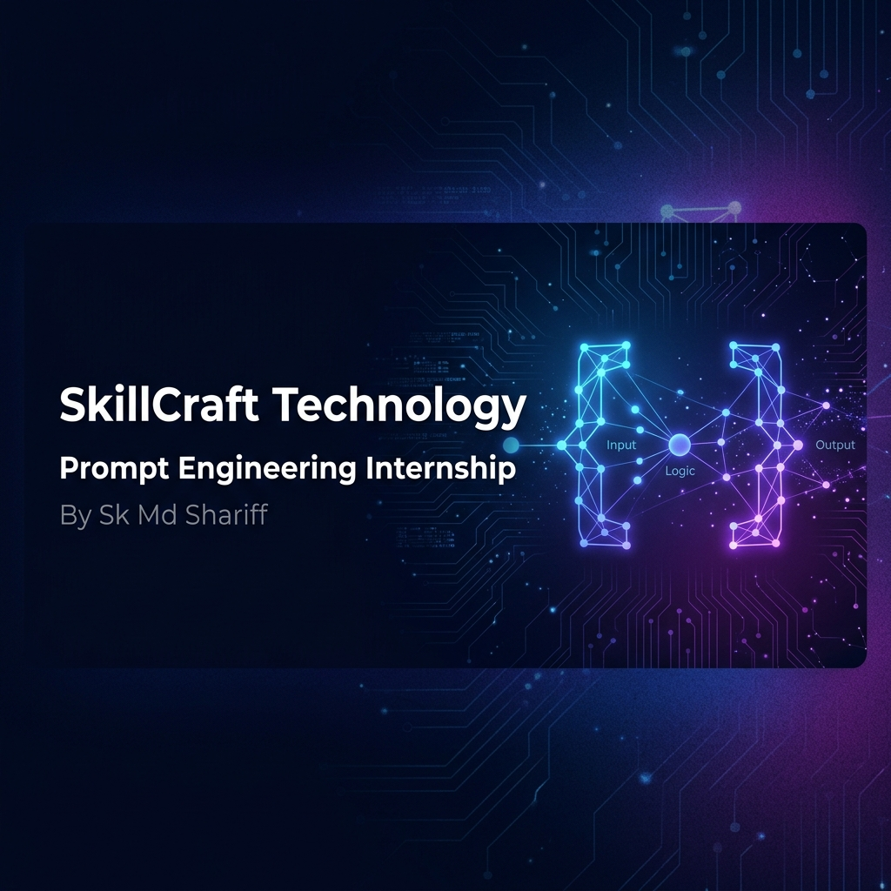

# 🚀 SkillCraft Technology: Prompt Engineering Internship

<div align="center">
  
  

  [](https://openai.com/)
  [](https://github.com/skmdshariff143-ai)
  [](https://opensource.org/licenses/MIT)
  [](https://github.com/skmdshariff143-ai)

</div>

## 📌 Overview
This repository contains the advanced prompt engineering projects, AI workflows, and automation pipelines developed during my **Prompt Engineering Internship at SkillCraft Technology**. The focus of this internship was to move beyond basic conversational AI interactions and engineer deterministic, highly-constrained, and production-ready outputs from Large Language Models (LLMs). 

## 🎯 Project Objectives
- **Design and Optimize Prompts:** Construct zero-shot, few-shot, and Chain-of-Thought (CoT) prompts to maximize LLM accuracy and reduce hallucinations.
- **Implement State-Machine Workflows:** Build autonomous LLM conversational agents (like Interview Assistants) that follow rigid, multi-turn logic.
- **Data Automation:** Engineer deterministic prompts that convert unstructured text (meeting notes, research papers) into strictly formatted JSON and structured summaries.
- **Creative & Business Ideation:** Utilize negative constraints and elite personas to bypass the LLM "regression to the mean," producing venture-scale B2B startup concepts and high-converting marketing copy.

## 🛠️ Technologies & Frameworks Used
- **Core AI/LLMs:** OpenAI GPT-4o, Anthropic Claude
- **Techniques:** Few-Shot Prompting, State-Machine Prompting, Negative Constraints, Persona Adoption
- **Data Formats:** JSON, Markdown
- **Tools:** Git, GitHub

## 🧠 Core Skills & Competencies Acquired
- **Advanced Prompting:** Controlling output formats, tone, and pacing through explicit constraints.
- **Context Window Management:** Structuring long-form inputs (transcripts, research papers) for optimal LLM parsing.
- **Systematic Evaluation:** Analyzing LLM outputs for logic leaks, hallucinations, and format adherence.
- **AI Safety & Alignment:** Implementing behavioral constraints to prevent conversational agents from breaking character.

## 🚀 Getting Started

### Prerequisites
- A modern web browser
- Access to an LLM interface (ChatGPT, Claude, or OpenAI API)

### Installation
1. **Clone the repository:**
   ```bash
   git clone https://github.com/skmdshariff143-ai/SkillCraft-Prompt-Engineering.git
   cd SkillCraft-Prompt-Engineering
   ```
2. **Explore the Tasks:**
   Navigate to the `projects/` directory to view the detailed documentation, prompt iterations, and simulated AI outputs for each task.

## 📂 Featured Projects

*Detailed documentation for each project can be found in their respective directories within `/projects`.*

1. **[Task 01: Writing Better Prompts](./projects/Task-01-Writing-Better-Prompts/)**: Foundational prompt engineering utilizing personas and formatting constraints across diverse domains.
2. **[Task 02: AI Startup Idea Generator](./projects/Task-02-AI-Startup-Idea-Generator/)**: Bypassing LLM mediocrity using negative constraints to generate a VC-grade B2B pitch memo.
3. **[Task 03: Creative Prompting Projects](./projects/Task-03-Creative-Prompting-Projects/)**: Structuring creative outputs for narrative sci-fi fiction and D2C marketing ad copy.
4. **[Task 04: Meeting Notes to JSON Converter](./projects/Task-04-Meeting-Notes-JSON-Converter/)**: Transforming AI into a deterministic data extraction pipeline with strict schema enforcement.
5. **[Task 05: Prompt Automation Projects](./projects/Task-05-Prompt-Automation-Projects/)**: High-volume professional automation for email drafting and dense academic research summarization.
6. **[Task 06: Interview Preparation Assistant](./projects/Task-06-Interview-Preparation-Assistant/)**: Designing a multi-turn, state-machine conversational AI mock interviewer.

## 🔮 Future Improvements
- **API Integration:** Transitioning these web-based prompt concepts into executable Python scripts using the OpenAI API.
- **Retrieval-Augmented Generation (RAG):** Grounding the research summarization prompts in external PDF knowledge bases.
- **Automated Testing:** Implementing unit tests to verify JSON schema adherence over 100+ simulated meeting transcripts.

## 🤝 Let's Connect
I am currently seeking full-time roles as an AI Engineer, Prompt Engineer, or AI Automation Specialist.
- **GitHub:** [@skmdshariff143-ai](https://github.com/skmdshariff143-ai)
- **LinkedIn:** [Mahammad Shariff Shaik](https://www.linkedin.com/in/mahammad-shariff-shaik-32903934a/)
- **Email:** sk.md.shariff143@gmail.com
