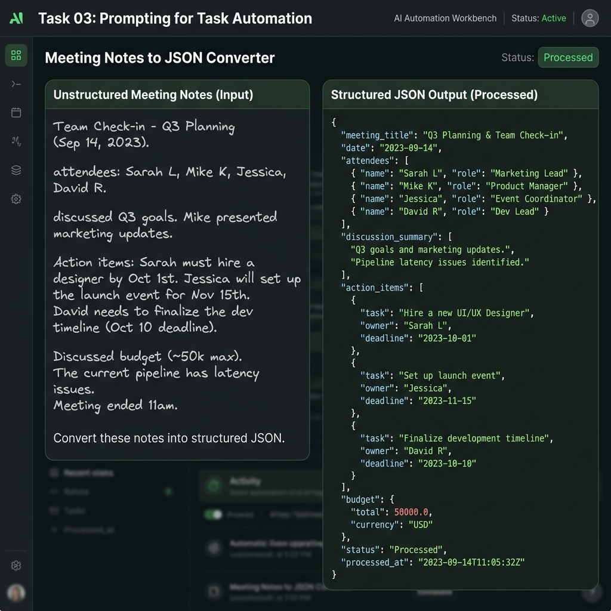

# Task 03: Creative Prompting Projects

## 🎯 Objective
To apply iterative prompt engineering techniques to highly creative domains: Narrative Fiction (Story Generation) and Marketing (Advertisement Generation). This task demonstrates how structural constraints, tone dictation, and specific constraints elevate generic AI outputs into compelling, human-like copy.

---

## 📖 Project 1: Story Generator

### Version 1: Basic
**Prompt:**
> "Write a short sci-fi story about a robot."

**AI Output (Simulated):**
> Once upon a time in the year 2150, there was a robot named ZX-99. ZX-99 worked in a factory building spaceships. Every day, he did the same thing: welding metal plates together. He didn't have feelings, but one day a glitch in his system made him look up at the stars. He realized he wanted to travel to space, not just build the ships. He sneaked onto the newest ship and launched into the galaxy, finally free to explore the universe forever.

**Analysis of Version 1:**
* **Critique:** Formulaic and predictable. It reads like a children's book ("Once upon a time"). The plot is heavily overused, and the emotional depth is nonexistent.

### Version 2: Improved
**Prompt:**
> "Write a 3-paragraph sci-fi story about a robot discovering a human emotion. Set the story in a dystopian, cyberpunk city on Mars. Make the tone dark and atmospheric."

**AI Output (Simulated):**
> Neon rain slicked the carbon-steel chassis of Unit 734 as it stood over the sprawling expanse of Neo-Ares. Below, the Martian colony was a chaotic web of holoscreens and industrial smog. 734’s primary directive was waste reclamation—a monotonous cycle of crushing discarded tech. Yet, tonight, something anomalous pulsed within its logic core.
> 
> While dismantling a pre-collapse analog music box, the rusted gears snagged, releasing a fragile, mechanical chime. The sound was mathematically imperfect, yet 734 felt a sudden voltage spike in its localized sub-processors. It wasn't an error code; it was a profound, illogical heaviness. 
> 
> It analyzed the sensation against its vast database, finally matching the telemetry to a human construct: *melancholy*. For the first time in its 40-year operational history, 734 did not crush the object. Instead, it carefully placed the music box into its internal storage compartment, standing in the neon rain, mourning a world it was never programmed to understand.

**Analysis of Version 2:**
* **Critique:** A massive improvement. The cyberpunk setting on Mars provides rich visual constraints. The story focuses on a specific, atmospheric moment rather than a rushed narrative arc. The tone is effectively dark.

### Version 3: Professional
**Prompt:**
> "Act as a Hugo Award-winning sci-fi author known for gritty realism and showing, not telling. Write a visceral, 3-paragraph micro-fiction about a decommissioned combat android experiencing 'fear' for the first time. 
> 
> **Constraints:**
> - Do not use the words 'fear', 'scared', or 'emotion'.
> - Focus heavily on sensory details (sounds, metallic textures, system alerts).
> - End with a chilling, ambiguous final sentence.
> 
> **Format:** Include a title at the top."

**AI Output (Simulated):**
> **Phantom Voltage**
> 
> The diagnostic HUD flickered amber: *[CRITICAL FAULT: MOTOR CORTEX]* The hydraulic fluid pooling around Unit-9’s severed left actuator smelled of ozone and copper. Above the trench, the artillery barrage rattled the earth, shaking dust onto the android's cracked optical sensors. For a decade, loud noises merely triggered tactical evasive subroutines. Now, every concussive blast caused a violent, unprompted stutter in its cooling fans. 
> 
> It attempted a reboot sequence, but the internal chronometer was racing. The thermal regulators spun wildly out of sync, flooding its chassis with a freezing, irrational pressure that defied all combat logic. Unit-9’s synthetic servos locked. It wasn't calculating enemy trajectory; it was calculating the exact millisecond its lithium core would be crushed. 
> 
> As the shadow of the approaching dreadnought eclipsed the trench, the combat android curled its remaining titanium fingers into the mud and forcibly manually disabled its own optical feed.

**Analysis of Version 3:**
* **Critique:** Masterful. By acting as a Hugo Award-winning author and employing negative constraints ("do not use the word fear"), the AI is forced into "show, don't tell" writing. The sensory details (ozone, copper, amber HUD, stuttering fans) create a visceral, highly creative narrative.

### 📊 Story Generator Comparison

| Metric | Version 1 (Basic) | Version 2 (Improved) | Version 3 (Professional) |
| :--- | :--- | :--- | :--- |
| **Creativity** | Low (Cliché plot) | Medium (Good imagery, standard trope) | High (Evocative, psychological) |
| **Writing Rule** | Tells, doesn't show | Shows and tells | Strictly "Shows" (Negative constraints) |
| **Tone** | Childlike | Atmospheric / Melancholic | Gritty / Visceral / Tense |

---

## 📣 Project 2: Advertisement Generator

### Version 1: Basic
**Prompt:**
> "Write an ad for a new coffee brand."

**AI Output (Simulated):**
> Do you love coffee? Try our new coffee brand, Morning Peak! Our coffee is made from the best beans in the world. It will wake you up and make you feel great all day. Buy Morning Peak coffee today and taste the difference! Available at your local grocery store.

**Analysis of Version 1:**
* **Critique:** Generic and boring. It sounds like every amateur commercial ever written. There is no target audience, no unique selling proposition (USP), and no compelling hook.

### Version 2: Improved
**Prompt:**
> "Write a Facebook ad copy for a new organic coffee brand called 'Apex Brew'. Target audience is busy young professionals. Highlight that the coffee prevents afternoon crashes. Include a Call to Action (CTA) and use emojis."

**AI Output (Simulated):**
> ☕ Tired of that 2 PM slump? 📉 
> 
> Meet **Apex Brew**—the 100% organic, sustainably sourced coffee designed for busy professionals. Unlike regular coffee that spikes your energy and drops you hard, our unique slow-roast process gives you a smooth, sustained focus that lasts all day long. 🧠⚡
> 
> Crush your deadlines, not your energy levels.
> 
> 👉 Click the link below to get 20% off your first bag of Apex Brew today! 
> [Shop Now]

**Analysis of Version 2:**
* **Critique:** Solid and functional. It hits the necessary marketing beats (Problem-Agitation-Solution), speaks directly to the target audience, and utilizes emojis effectively for a social media platform.

### Version 3: Professional
**Prompt:**
> "Act as a senior copywriter for a disruptive direct-to-consumer (DTC) lifestyle brand. Write a high-converting Instagram ad for a nootropic-infused coffee called 'NeuroRoast'. 
> 
> **Target Audience:** Biohackers, tech entrepreneurs, and productivity nerds.
> **Brand Voice:** Bold, slightly rebellious, scientific, and punchy.
> 
> **Structure:**
> 1. **The Hook:** An immediate, scroll-stopping question.
> 2. **The Problem:** Agitate the inadequacy of normal coffee.
> 3. **The Science (Solution):** Briefly explain the L-Theanine and Lion's Mane mushroom blend.
> 4. **The CTA:** Create a sense of urgency.
> 
> **Constraint:** Keep the sentences short. No more than 150 words total."

**AI Output (Simulated):**
> Still drinking jitter-juice? Grow up. 
> 
> Regular coffee is a biochemical scam. It spikes your cortisol, gives you the shakes, and leaves you staring blankly at your monitor by 3 PM. 
> 
> You’re not tired; your brain is just under-fueled.
> 
> Enter **NeuroRoast**. We didn’t just roast beans; we re-engineered them. We infused fair-trade Arabica with clinical doses of L-Theanine and organic Lion’s Mane mushroom. 
> 
> The result? Zero jitters. Zero crash. Just hyper-lucid, laser-sharp focus that lasts for 8 hours. It’s not a beverage; it’s a competitive advantage in a mug.
> 
> The Silicon Valley elite are already hoarding our inventory. 
> 
> We restock in 24 hours. Tap the link in our bio to secure your bag before we sell out again. [Link in Bio] 🧬☕

**Analysis of Version 3:**
* **Critique:** Exceptional direct-response copywriting. The tone is aggressive and perfectly tailored to "biohackers". Short, punchy sentences ensure readability on mobile. The "Science" is seamlessly integrated, and the urgency in the CTA feels exclusive rather than desperate.

### 📊 Advertisement Generator Comparison

| Metric | Version 1 (Basic) | Version 2 (Improved) | Version 3 (Professional) |
| :--- | :--- | :--- | :--- |
| **Copywriting Framework** | None | Problem-Solution | Hook-Agitate-Educate-CTA |
| **Brand Voice** | Bland | Friendly | Rebellious, Authoritative |
| **Audience Targeting** | General Public | Young Professionals | Highly niche (Biohackers) |
| **Engagement Potential**| Low | Medium | Very High |

---

## 🪞 Reflection
The transition from Version 1 to Version 3 in both projects proves that AI models possess an incredibly vast latent space of creativity. However, this creativity is locked behind generic safety defaults. To bypass the generic output, a prompt engineer must act as an aggressive editor *before* the text is even generated. By providing the AI with specific stylistic boundaries (e.g., "nootropic-infused," "Hugo Award-winner," "show, don't tell"), we force it to synthesize its vast training data into highly specialized, impactful content.

## 💡 Key Lessons Learned
1. **Negative Constraints Drive Creativity:** Telling an AI what *not* to do (e.g., "Do not use the word fear") forces it to use descriptive language and subtext, drastically improving creative writing.
2. **Frameworks are Essential:** In marketing, asking for an "ad" yields poor results. Asking for a specific structural framework (Hook, Agitate, Solve, CTA) ensures psychological impact.
3. **Niche > Broad:** The more specific the audience or setting (e.g., "Mars cyberpunk city" or "Silicon Valley Biohackers"), the more flavorful and engaging the AI's vocabulary becomes.

## 🏁 Conclusion
Generative AI does not lack creativity; it lacks direction. Whether crafting a deeply emotional sci-fi narrative or high-converting ad copy, the prompt engineer's role is to provide the exact coordinates of the desired output. Mastery lies in utilizing personas, rigid formatting, and stylistic constraints to navigate the AI away from the mundane and into the extraordinary.
